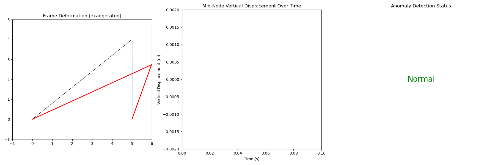

Digital Twin: FEM Frame Simulation & Anomaly Detection
A Python simulation of a 2D frame structure using Finite Element Method with:

Real-time deformation under dynamic loading

Displacement and strain sensor modeling

Threshold-based anomaly detection

Animated visualization and live status display

Exports animation as frame_animation.gif

How to Run
pip install numpy matplotlib
python main.py

About
This tool demonstrates digital twin concepts and structural health monitoring for civil engineering applications.

